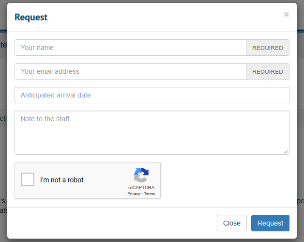

# ArchivesSpace reCAPTCHA plugin

Add reCAPTCHA functionality to the ArchivesSpace PUI request form.

## Versions

This plugin requires ArchivesSpace v2.8.1+.

## Setup

You need API credentials for your site from the Google Admin Console:

https://www.google.com/recaptcha/about/

This plugin has only been tested with the `reCAPTCHA v2 Checkbox API`.

Add the site key and secret to `AppConfig`:

```ruby
AppConfig[:recaptcha_site_key] = 'key'
AppConfig[:recaptcha_secret_key] = 'secret'
AppConfig[:plugins] << 'aspace-recaptcha' # add this plugin to the list
```

Alternatively you can use environment variables:

- `APPCONFIG_RECAPTCHA_SITE_KEY`
- `APPCONFIG_RECAPTCHA_SECRET_KEY`

Download the recaptcha plugin to your ArchivesSpace plugins directory
then run the initialize script:

```bash
./scripts/initialize-plugin.sh aspace-recaptcha
```

Fire up ArchivesSpace as usual. There should now be a reCAPTCHA checkbox
on request forms.


